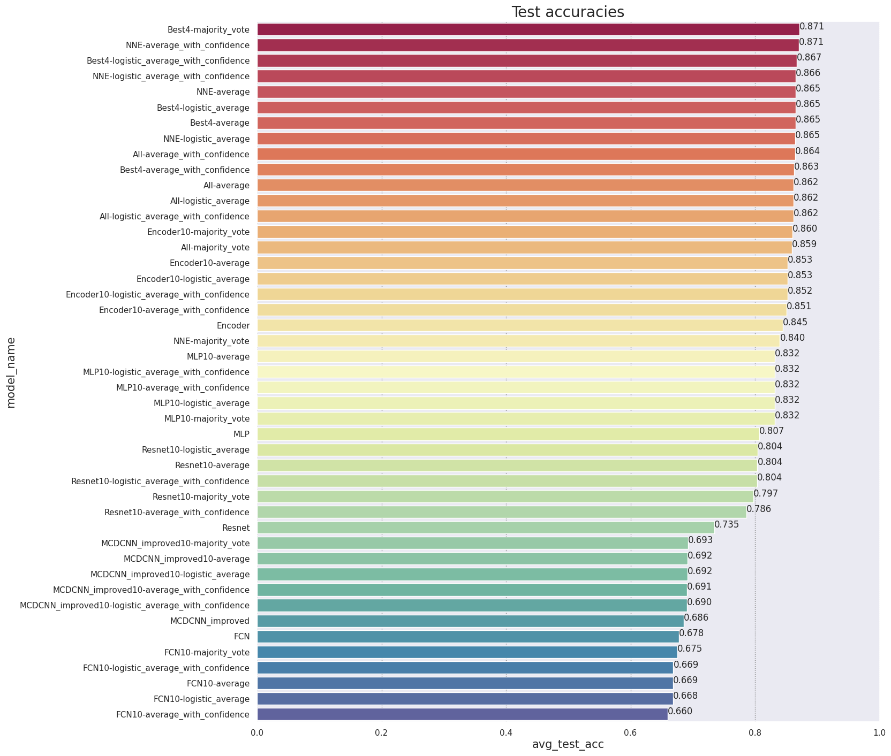

# EnsembleBasedTSC

Project based on the paper Deep Neural Network Ensembles for Time Series Classification (2019) by Hassan Ismail Fawaz, Germain Forestier, Jonathan Weber, Lhassane Idoumghar, Pierre-Alain Muller

## Project Structure

The project uses Jupyter notebooks which combine the python sources.

| File | Description |
|-|-|
|Ensemble.py | Provides the Ensemble class which allows combining trained models into an ensemble|
|Ensemblebuilder.py| Provides methods to evaluate multiple Ensembles|
|Evaluation.py| Provides helper methods to display results |
|Helpers.py| Provides useful methods|
|LoadData.py| Provides methods to load the datasets|
|ModelBuilder.py| Provides methods that create keras models|
|PreprocessData.py| Provides means to add noise to datasets|
|TrainProdecure.py| Provides methods to train models|

## Usage

Install requirements and run the respective Jupyter notebook

## Results

